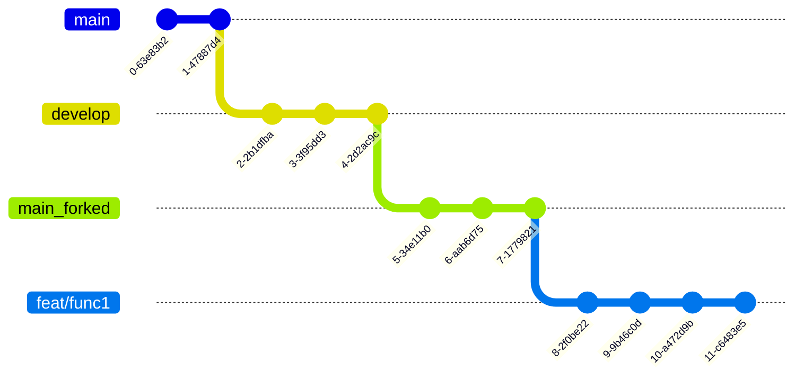

# 여행에 즐거움을 더하다 **triPlus** ✈️

**[배포 URL]**

- URL:

**[계정]**

- 🧑🏻‍💻 id:
- 🔐 password:

<!-- 이미지 -->

- 여기에 이미지 삽입

<br>

## 1. 소개 👥

- ✈️triPlus는 다양한 사용자들의 **폭넓은 여행 후기** 및 **자신의 여행 상품을 홍보**할 수 있는 **SNS서비스**입니다.

- 여행의 재미를 더하자는 취지에서 `'trip` 과`'plus'`라는 두 단어의 합성어로 서비스명을 정했습니다.

- 사용자는 사진을 통해 여행 후기를 공유할 수 있으며, 다른 사용자와 **좋아요** 및 **댓글**을 주고 받을 수 있습니다.

- 다른 사용자들과의 **팔로우**를 통해 자유로운 댓글 작성 및 홈 피드를 공유할 수 있습니다.

## 🙋‍♀️ triPlus 구성원 🙋‍♂️

|                                          **김대엽**                                          |                                                                **문승규**                                                                |                                                         **방지영**                                                          |                                                                             **서정연**                                                                              |
| :------------------------------------------------------------------------------------------: | :--------------------------------------------------------------------------------------------------------------------------------------: | :-------------------------------------------------------------------------------------------------------------------------: | :-----------------------------------------------------------------------------------------------------------------------------------------------------------------: |
|       |  |  |  |
| [**GitHub**](https://github.com/kimdaeyeobbb) <br>[**blog**](https://blog.naver.com/kimdyk1) |                                               [**GitHub**](https://github.com/munseunggyu)                                               |                                          [**GitHub**](https://github.com/marrron/)                                          |                                                              [**GitHub**](https://github.com/yeon1128)                                                              |

<br>

## 2. 역할 분담 👨‍👩‍👧‍👧

### 🧑🏻‍💻김대엽

- 역할

  - 팀 리딩
  - 컨벤션 관리
  - 깃허브 Project Board 관리<br>
    (작업에 대한 진척도를 가시적으로 표시하며 협업 능력 상승)

- UI

  - 컴포넌트: 버튼, 이미지 박스, 인풋 박스
  - 페이지: Splash, 회원가입, 로그인 화면, 프로필 설정, 프로필 수정

- 기능
  - 유효성 검사, 회원가입, 로그인, 프로필 수정

### 🧑🏻‍💻문승규

- 역할

  - 코드리뷰
  - 커스텀 훅 강의
  - 스타일드 컴포넌트 강의
  - 컨벤션 관리

- UI

  - 컴포넌트: 헤더, 게시글 카드, 유저 정보
  - 페이지: 홈, 프로필, 404, 검색, 팔로우

- 기능
  - 검색기능, 팔로우, 좋아요, 게시글 피드, 커스텀 훅, 무한 스크롤

### 👩🏻‍💻방지영

- 역할

  - 피그마 세팅
  - 웹사이트 로고 디자인 제작
  - 페이지 내 기본 이미지 제작

- UI

  - 컴포넌트: 모달
  - 페이지: 채팅 리스트, 상품 등록 페이지

- 기능
  - 상품 등록, 상품 등록시 유효성 검사, 이미지 프리뷰

### 👩🏻‍💻서정연

- 역할

  - 프로젝트 진행과정 문서화
  - 의견 수렴을 위한 구글폼 제작 및 결과분석
  - 회의록 작성 및 팀 노션 정리

- UI

  - 컴포넌트: 하단 네브바, 하단 코멘트바
  - 페이지: 채팅방, 로딩, 게시글 상세, 게시글 업로드

- 기능
  - 게시글 및 댓글 업로드/수정/삭제/신고 기능, 이미지 프리뷰 커스텀 훅
    <br>

## 3. 개발 일정 📆

#### 기간 : 2022.12.09(금) ~ 2023.01.04(수)

<br>

## 4. 개발 환경 및 회의록🔗

**[개발 환경]**

- Front-End: React, Styled-components
- Back-End: 제공된 API 사용
- 디자인 도구: [🎨Figma](https://www.figma.com/file/Qcxn5LaToq0uhbrvZeHwl8/Untitled?t=254MQgkNmEv6hDyF-0)

### 기술 스택 선정 이유

- ㅁ

<br>

**[회의록 및 진행상황 공유]**

- 프로젝트 회의 : 매주 월,목 오전9시
- 📚 회의록: [GitHub-Wiki](https://github.com/9ivot/triplus/wiki)
- 🔖 프로젝트 진행상황: [GitHub-Projects](https://github.com/orgs/9ivot/projects/1)

<br>

## 5. 개발 규칙 🤙🏻

### 개발 규칙 선정 이유

- 팀원간의 의사소통 비용을 줄이기 위해서 선정하였습니다

### ❗ 커밋 컨벤션

```plain text
type: short summary

# type: 커밋 타입
# short summary: 커밋에 대한 간단한 설명
```

- 예시

```bash
feat: 라이트 모드 기능 추가
```

#### 커밋 타입

| 커밋     | 타입 설명                                                                                        |
| :------- | :----------------------------------------------------------------------------------------------- |
| docs     | 문서 수정(md 파일 등)                                                                            |
| feat     | 새로운 기능 추가                                                                                 |
| style    | 스타일 변경 (포매팅 수정, 들어쓰기 추가, 빈칸 제거, 스펠링 오류 등)                              |
| refactor | 리팩토링 작업(코드 동작은 유지하되, 코드의 가독성 및 유지보수성을 향상시키기 위한 내부구조 변경) |
| fix      | 버그 수정                                                                                        |
| revert   | 커밋 취소(reset 사용금지)                                                                        |
| test     | 테스트 코드 추가, 기존 테스트 수정                                                               |
| build    | 빌드 관련 파일 수정 (패키지 매니저 설정등 개발코드와 무관한 부분)                                |

<br>

#### 커밋 설명 규칙

- 명령조의 현재시제를 사용한다 (과거형이나 3인칭 사용X)
  - changed(x), changes(x)
  - change(o)
- 첫 글자는 항상 소문자로 기재한다
- 마침표를 찍지 않는다
- 커밋 메시지의 각 줄은 50자를 넘기지 않는다

<br>

### 🔃 Branch 전략



- main repo > main branch: 배포용
- main repo > develop branch: 개발용 (여기서 개발완료시 main repo의 main branch로 PR하여 배포)
- forked repo > main branch
- forked repo > feat/func1 : 기능별 구현시 main repo의 develop branch로 PR
- 기능별 구현을 할때마다 PR (커밋을 모아서 PR하기를 권장)

<!-- ## 5. 프로젝트 구조 🗂 -->

<!-- 폴더 구조를 좀 정리해서 마지막에 싹 넣으면 좋을 것 같습니다. -->

```bash
├─ .env
├─ .github
│  ├─ ISSUE_TEMPLATE
│  │  └─ 개인-주차별-작업내용-템플릿.md
│  └─ pull_request_template.md
├─ .gitignore
├─ README.md
├─ package-lock.json
├─ package.json
├─ public
│  ├─ favicon.ico
│  └─ index.html
└─ src
   ├─ App.jsx
   ├─ assets
   │  └─ images
   │     ├─ circle.svg
   │     ├─ css_sprites.png
   │     ├─ error_404.svg
   │     ├─ file_gray.svg
   │     ├─ loading.png
   │     ├─ main_logo.svg
   │     ├─ more_vertical.png
   │     ├─ plain_blue.svg
   │     ├─ plain_white.svg
   │     ├─ upload_file.svg
   │     ├─ user_img_big.svg
   │     ├─ user_img_small.svg
   │     └─ x.png
   ├─ components
   │  ├─ Button
   │  │  ├─ FollowBtn
   │  │  │  ├─ IsFollowButton.jsx
   │  │  │  └─ style.js
   │  │  ├─ LongBtn.jsx
   │  │  ├─ MiddleSmallBtn
   │  │  │  └─ MiddleSmallBtn.jsx
   │  │  └─ SaveBtn
   │  │     ├─ index.jsx
   │  │     └─ style.js
   │  ├─ CommentBar
   │  │  ├─ index.jsx
   │  │  └─ style.js
   │  ├─ Header
   │  │  ├─ HeaderTitle.jsx
   │  │  ├─ Prev.jsx
   │  │  ├─ SearchButton.jsx
   │  │  ├─ SearchInput.jsx
   │  │  ├─ Vertical.jsx
   │  │  ├─ index.jsx
   │  │  └─ style.js
   │  ├─ ImageBox
   │  │  └─ index.jsx
   │  ├─ InputBox
   │  │  └─ index.jsx
   │  ├─ MainContainer.js
   │  ├─ Modal
   │  │  ├─ AlertModal.jsx
   │  │  ├─ ModalContainer.jsx
   │  │  ├─ ModalList.jsx
   │  │  └─ style.js
   │  ├─ Navbar
   │  │  ├─ index.jsx
   │  │  └─ style.js
   │  ├─ PostCard
   │  │  ├─ PostCardBtns.jsx
   │  │  ├─ index.jsx
   │  │  └─ style.js
   │  └─ UserInfo
   │     ├─ index.jsx
   │     └─ style.js
   ├─ hooks
   │  ├─ useFollowBtn.js
   │  ├─ useGetData.js
   │  ├─ useGetPreview.js
   │  ├─ useHeartBtn.js
   │  ├─ useModal.js
   │  ├─ useObserver.js
   │  ├─ usePostUpload.js
   │  └─ useReloadData.js
   ├─ index.jsx
   ├─ pages
   │  ├─ ChatList
   │  │  ├─ ChattingList.jsx
   │  │  ├─ index.jsx
   │  │  └─ style.js
   │  ├─ ChatRoom
   │  │  ├─ ChatBar.jsx
   │  │  ├─ ChatHeader.jsx
   │  │  ├─ ChatReceive.jsx
   │  │  ├─ ChatSend.jsx
   │  │  ├─ ChatVertical.js
   │  │  ├─ Chattings.jsx
   │  │  ├─ index.jsx
   │  │  └─ style.js
   │  ├─ EmailLogin
   │  │  └─ index.jsx
   │  ├─ EmailSignUp
   │  │  └─ index.jsx
   │  ├─ ErrorPage
   │  │  ├─ index.jsx
   │  │  └─ style.js
   │  ├─ Follow
   │  │  ├─ index.jsx
   │  │  └─ style.js
   │  ├─ Home
   │  │  ├─ HomeNoFollow.jsx
   │  │  ├─ index.jsx
   │  │  └─ style.js
   │  ├─ LoadingPage
   │  │  ├─ index.jsx
   │  │  └─ style.js
   │  ├─ MultiLogin
   │  │  ├─ JoinLink.jsx
   │  │  ├─ LoginModal.jsx
   │  │  ├─ SocialLoginItem.jsx
   │  │  └─ index.jsx
   │  ├─ MyProfileAddProduct
   │  │  └─ index.jsx
   │  ├─ MyProfileEdit
   │  │  └─ index.jsx
   │  ├─ PostDetail
   │  │  ├─ Comment.jsx
   │  │  ├─ UserPostDetail.jsx
   │  │  ├─ index.jsx
   │  │  └─ style.js
   │  ├─ PostUpload
   │  │  ├─ PreviewList.jsx
   │  │  ├─ index.jsx
   │  │  └─ style.js
   │  ├─ ProductUpload
   │  │  ├─ index.jsx
   │  │  └─ style.js
   │  ├─ Profile
   │  │  ├─ BottomSection.jsx
   │  │  ├─ MidSection.jsx
   │  │  ├─ TopSection.jsx
   │  │  ├─ TopSectionMy.jsx
   │  │  ├─ TopSectionYour.jsx
   │  │  ├─ index.jsx
   │  │  └─ style.js
   │  ├─ Search
   │  │  ├─ index.jsx
   │  │  └─ style.js
   │  ├─ SetProfile
   │  │  └─ index.jsx
   │  └─ SplashScreen
   │     ├─ index.jsx
   │     └─ splashEvent.jsx
   ├─ theme.js
   └─ utils
      ├─ handleCommentTime.js
      ├─ handleDeclaration.js
      └─ handleDelete.js
```

<br>

## 6. 구현 기능 🛠

### 6-1. 홈

<table>
    <tbody>
        <tr></tr>
        <tr>
            <th>시연</th>
            <th>설명</th>
        </tr>
        <tr>
            <td></td>
            <td>Splash<ul>
                    <li>시작하기 버튼을 통해 서비스에 접속할 수 있습니다.</li>
                    <li>`로그인 상태`: 메인 게시판으로 이동</li>
                    <li>`비로그인 상태`: 로그인화면으로 이동</li>
                </ul>
            </td>
        </tr>
        <tr>
            <td></td>
            <td>회원가입<ul>
                    <li>시작하기 버튼을 통해 서비스에 접속할 수 있습니다.</li>
                    <li>로그인: 메인 게시판으로 이동</li>
                    <li>비로그인: 로그인화면으로 이동</li>
                </ul>
            </td>
        </tr>
        <tr>
            <td></td>
            <td>로그인 (multilogin)
                <ul>
                    <li>시작하기 버튼을 통해 서비스에 접속할 수 있습니다.</li>
                    <li>로그인: 메인 게시판으로 이동</li>
                    <li>비로그인: 로그인화면으로 이동</li>
                </ul>
            </td>
        </tr>
        <tr></tr>
        <tr>
            <td></td>
            <td>triPlus 피드<ul>
                    <li>팔로우한 유저가 없다면 유저를  검색하는 문구와 검색하기 버튼이 나옵니다.</li>
                    <li>팔로우한 유저가 있다면 유저들의 게시글의 피드를 10개를 보여줍니다.</li>
                    <li> 스크롤이 맨 아래로 이동 후 피드가 더 있으면 피드를 더 불러옵니다 </li>
                </ul>
            </td>
        </tr>
        <tr></tr>
        <tr>
            <td></td>
            <td>회원가입<ul>
                    <li>사용자의 정보를 입력받아 회원가입을 진행합니다.</li>
                    <li>유효성 검사를 진행하고, 오류 메시지를 전달합니다.</li>
                    <li>모달창을 이용하여 커뮤니티 규칙과 개인정보 수집/이용 동의를 제공합니다.</li>
                </ul>
            </td>
        </tr>
    </tbody>
</table>
    
<br>
    
### 6-2. 검색 및 프로필
<table>
    <tbody>
        <tr></tr>
        <tr>
            <th>시연</th>
            <th>설명</th>
        </tr>
        <tr>
            <td></td>
            <td>검색<ul>
                    <li>검색창에 검색어를 입력하면 0.3초 후 에 해당 유저들의 데이터를 요청한다음 보여줍니다.</li>
                    <li>유저를 클릭하면 해당 유저의 프로필로 이동합니다.</li>
                </ul>
            </td>
        </tr>
        <tr>
            <td></td>
            <td>팔로우 및 팔로잉<ul>
                   <li>팔로우 버튼을 클릭하면 해당 유저를 팔로우합니다.</li>
                    <li>팔로우 한 상태에서 언팔로우 버튼을 클릭하면 해당 유저를 언팔로우 합니다.</li>
                </ul>
            </td>
        </tr>
        <tr>
            <td></td>
            <td>프로필<ul>
                  <li>하단 메뉴바에서 프로필을 클릭하면 자신의 프로필을 보여줍니다.</li>
                    <li>팔로잉,팔로워 수를 표시하고 프로필 수정, 상품 등록을 할 수 있습니다.</li>
                    <li>내가 등록한 게시글과 판매중인 상품을 보여줍니다.</li>
                    <li>다른 사용자의 프로필에서는 팔로우, 언팔로우를 할 수 있고 해당 사용자의 게시글과 판매상품을 볼 수 있습니다.</li>
                </ul>
            </td>
        </tr>
        <tr>
            <td></td>
            <td>프로필 수정하기<ul>
                    <li></li>
                    <li></li>
                    <li>.</li>
                </ul>
            </td>
        </tr>
    </tbody>
</table>
<br>

### 6-3. 게시글

<table>
    <tbody>
        <tr></tr>
        <tr>
            <th>시연</th>
            <th>설명</th>
        </tr>
        <tr>
            <td></td>
            <td>게시글 작성<ul>
                   <li>
                    하단 메뉴바에서 게시글 작성을 클릭하면 표시됩니다.
                    </li>
                    <li>글이 입력되거나 사진이 업로드 되면 업로드 버튼이 활성화되고 버튼을 누르면 게시글이 업로드됩니다.</li>
                    <li>최대 3장까지 이미지 업로드 가능합니다.</li>
                </ul>
            </td>
        </tr>
        <tr></tr>
        <tr>
            <td></td>
            <td>게시글 상세<ul>
                    <li>게시글 하단  말풍선 아이콘을 클릭하면 게시글 상세 페이지로 이동합니다.</li>
                    <li>게시글 우측 상단 버튼을 클릭하면 자신의 게시글일 경우 삭제, 수정 버튼이 나오고 타인이 작성한 게시글일 경우 신고 버튼이 나타납니다.</li>
                    <li>댓글 확인 및 작성이 가능합니다.</li>
                </ul>
            </td>
        </tr>
        <tr>
            <td></td>
            <td>게시글 수정<ul>
                    <li>게시글 우측 상단 버튼을 클릭했을 경우 내가 작성한 게시글이라면 삭제, 수정 버튼이 나타납니다.</li>
                    <li>수정 버튼을 클릭하면 수정 가능합니다. 텍스트, 이미지를 삭제하거나 추가할 수 있습니다. </li>
                </ul>
                </ul>
            </td>
        </tr>
        <tr>
            <td></td>
            <td>게시글 삭제<ul>
                    <li>자신이 작성한 게시글인 경우 게시글 우측 버튼을 클릭하면 삭제, 수정 버튼이 나타납니다.</li>
                    <li>삭제 모달의 삭제 버튼을 클릭하면 게시글이 삭제됩니다. </li>
                </ul>
            </td>
        </tr>
         <tr>
            <td></td>
            <td>게시글 신고<ul>
                    <li>타인이 작성한 게시글일 경우 게시글 우측 버튼을 클릭하면 신고 버튼이 나타납니다.</li>
                    <li>신고 모달의 신고 버튼을 클릭하면 게시글이 신고됩니다. </li>
                </ul>
            </td>
        </tr>
        <tr>
            <td></td>
            <td>좋아요<ul>
                    <li>게시글에 좋아요 버튼을 클릭하면 좋아요 수가 증가합니다.</li>
                    <li>좋아요 된 게시글에 한 번 더 누르면 좋아요가 취소되고 좋아요 수가 감소합니다.</li>
                </ul>
            </td>
        </tr>
    </tbody>
</table>
<br>

### 6-4. 상품

<table>
    <tbody>
        <tr></tr>
        <tr>
            <th>시연</th>
            <th>설명</th>
        </tr>
        <tr>
            <td></td>
            <td>상품 등록<ul>
                    <li>사용자의 프로필 정보를 제공합니다.</li>
                    <li>작성한 게시글, 좋아요, 스크랩한 게시글의 목록을 확인할 수 있습니다.</li>
                    <li>로그아웃을 할 수 있으며, 시작 페이지로 돌아갑니다.</li>
                </ul>
            </td>
        </tr>
        <tr></tr>
        <tr>
            <td></td>
            <td>상품 수정<ul>
                    <li>프로필 이미지를 변경하거나, 업로드한 이미지를 삭제할 수 있습니다.</li>
                    <li>새로운 닉네임의 중복 여부를 확인한 후 변경합니다.</li>
                </ul>
            </td>
        </tr>
         <tr>
            <td></td>
            <td>상품 삭제<ul>
                    <li>사용자의 프로필 정보를 제공합니다.</li>
                    <li>작성한 게시글, 좋아요, 스크랩한 게시글의 목록을 확인할 수 있습니다.</li>
                    <li>로그아웃을 할 수 있으며, 시작 페이지로 돌아갑니다.</li>
                </ul>
            </td>
        </tr>
    </tbody>
</table>

### 6-5. 댓글

<table>
    <tbody>
        <tr></tr>
        <tr>
            <th>시연</th>
            <th>설명</th>
        </tr>
        <tr>
            <td></td>
            <td>댓글 등록<ul>
                   <li>게시글 하단 말풍선 아이콘을 클릭하면 댓글을 확인하고 입력할 수 있는 페이지가 나타납니다.</li>
                    <li>댓글 입력창에 글을 입력하게 게시 버튼을 클릭하면 최상단에 댓글이 작성됩니다.</li>
                    <li>댓글의 사용자 이름 우측에 현재로부터 댓글 작성 시간이 얼마나 지났는지 표시됩니다.</li>
                </ul>
            </td>
        </tr>
        <tr></tr>
        <tr>
            <td></td>
            <td>댓글 삭제<ul>
                    <li>자신이 작성한 댓글일 경우 댓글 우측 버튼을 클릭하면 삭제 모달이 나타납니다.</li>
                    <li>삭제 버튼을 클릭하면 댓글이 삭제됩니다. 댓글 작성자만 삭제 가능합니다.</li>
                </ul>
            </td>
        </tr>
        <tr>
            <td></td>
            <td>댓글 신고<ul>
                  <li>타인이 작성한 댓글일 경우 댓글 우측 버튼을 클릭하면 신고 모달이 나타납니다.</li>
                    <li>신고 버튼을 클릭하면 댓글이 신고됩니다.</li>
                </ul>
            </td>
        </tr>
    </tbody>
</table>
<br>

<br>

## 7. 핵심 코드

### 커스텀 훅

#### 1) useGetData

- API 명세서를 보고 Get 요청에서 동일한 로직을 파악한 후 useGetData라는 커스텀 훅을 만들어 재사용성 높임
- 사용한 곳: 프로필 유저 정보, 상품 정보, 검색, 게시글 상세

  ```js
  export const useGetData = () => {
    const [data, setData] = useState(null);
    const [isLoading, setIsLoading] = useState(true);
    const userInfo = JSON.parse(localStorage.getItem("userinfo"));

    const getData = async (url, name) => {
      try {
        const res = await axios.get(url, {
          headers: {
            Authorization: `Bearer ${userInfo.token}`,
            "Content-type": "application/json",
          },
        });
        name ? setData(res.data[name]) : setData(res.data);
        setIsLoading(false);
      } catch (error) {
        console.log(error);
      }
    };

    return { data, isLoading, setData, getData };
  };
  ```

#### 2) useObserver

- 무한 스크롤을 이용하여 웹 최적화 및 사용성 개선
- Intersection Observer API사용
- 커스텀 훅으로 만들어 재사용
- 사용한 곳: 게시글 피드, 나의 게시글, 댓글, 팔로우 리스트

  ```js
  // hooks/useObserver.js
  export const useObserver = (reloadRef, pageNum) => {
    const [data, setData] = useState(null);
    const [isLoading, setIsLoading] = useState(true);
    const userInfo = JSON.parse(localStorage.getItem("userinfo"));
    const [page, setPage] = useState(0);
    const [reloading, setReloading] = useState(false);
    const [finishReload, setFinishReload] = useState(false);

    const loadMore = () => setPage((prev) => prev + pageNum);

    const getData = async (url, name) => {
      setReloading(true);
      try {
        const res = await axios.get(url, {
          headers: {
            Authorization: `Bearer ${userInfo.token}`,
            "Content-type": "application/json",
          },
        });
        if (name) {
          if (res.data[name].length === 0) {
            setFinishReload(true);
          }
        } else {
          if (res.data.length === 0) {
            setFinishReload(true);
          }
        }
        if (page > 0) {
          name
            ? setData((prev) => [...prev, ...res.data[name]])
            : setData((prev) => [...prev, ...res.data]);
        } else {
          name ? setData(res.data[name]) : setData(res.data);
        }
        setIsLoading(false);
        setReloading(false);
      } catch (error) {
        console.log(error);
      }
    };
    useEffect(() => {
      let observer;
      if (reloadRef.current && !finishReload) {
        const onIntersect = async ([entry], observer) => {
          if (entry.isIntersecting) {
            loadMore();
          }
        };
        observer = new IntersectionObserver(onIntersect, { threshold: 1 });
        observer.observe(reloadRef.current);
      }

      return () => observer && observer.disconnect();
    }, [isLoading]);

    return {
      data,
      isLoading,
      setData,
      getData,
      loadMore,
      page,
      reloading,
      finishReload,
      setPage,
      setFinishReload,
    };
  };
  ```

  ```js
  // pages/Home/index.jsx
  const curRef = useRef(null);
  const { data, isLoading, getData, page, reloading, finishReload } =
    useObserver(curRef, 10);
  const url = `${process.env.REACT_APP_API_KEY}/post/feed/?limit=10&skip=${page}`;

  useEffect(() => {
    if (!finishReload) {
      getData(url, "posts");
    }
  }, [page]);
  ```

<br>

## 8. 팀원간 의견충돌 상황 및 해결책

### 1) 프로젝트 방향성 확립에 있어 어려움을 겪음

- 적극적으로 의견을 수렴하기 위해 [Google form](https://docs.google.com/forms/d/e/1FAIpQLSfrKCyi2O1YnpiMQO8_BcmLygXV78SG0ymc_cJKD6mtILj7mg/viewform)을 활용하여 익명으로 의견을 공유했습니다.

### 2) 기술선정에 있어 충돌 발생

- pure CSS vs styled-components

#### pure CSS/Sass

- 기본에 충실해서 클래스 작명등을 연습하고자 하는 의견이 있었음

#### styled-components

- 벤더프리픽스가 자동으로 붙는 장점이 있음

- 클래스명이 중복될 위험에서 벗어남

- 유지보수와 다뤄야하는 파일범위가 줄어듦

- Sass는 노드버전에 의존적임

### 3) 커스텀 훅을 쓸지 api 를 모아 놓을 지 고민이 되었던 상황발생

- api 구조가 비슷하기 때문에 useGetData 훅을 만들어서 url을 다르게 넣어서 get 요청을 할 수 있도록 처리함

### 4) 의사소통에 있어 어려움을 겪음

- 물리적인 거리와 온라인 플랫폼 활용상의 한계점이 존재<br>
  (말이 겹침, 비언어적 표현을 감지할 수 없음)

- 의사소통 비용과 오해를 줄이기 위해서 템플릿 제작
  - git commit 커밋 템플릿
  - PR 템플릿
  - gitHub issue 템플릿
  - discord PR 알림 자동화

<br>

## 9. 트러블 슈팅

### 1) pixel ratio

- 문제 상황
  - 유저 기본 프로필 이미지가 블러 처리된 것처럼 흐리게 보인다.
- 원인 추론
  - 레티나 디스플레이는 논리픽셀과 물리픽셀의 차이가 발생한다. 그러나 브라우저는 css에서 정의한 픽셀만큼 이미지를 렌더링 해야하기 때문에 원래는 물리픽셀에 맞게 렌더링된 이미지가 논리픽셀 만큼 커져버리게 되었다.
- 해결 방법
  1. 화면에 우리가 그리고자 하는 사이즈의 2배 되는 이미지를 사용한다.
  2. svg를 사용한다 svg는 래스터 이미지(or 비트맵 이미지)와는 다르게 화면 크기가 달라져도 깨지지 않는다.

<br>

- 이미지 비교

  - 1배 png

      

  - 2배 png

      

  - svg

      

<br>

### 2) 커스텀 훅 안에서 커스텀 훅을 사용하지 못하는 이슈

- 문제상황
  - useDelete 커스텀 훅 안에 useGetCommentList 커스텀 훅을 넣어 사용했는데 불러온 함수가 정상적으로 작동하지 않음.
- 원인추론
  - 아래 코드를 예시로 각각의 함수가 실행되는 위치에 따라 실행되는 값이 달라지므로 원했던 기능이 제대로 구현되지 않음.

```js
const useModal = () => {
  return { a: 1 };
};
const a = useModal();
const b = useModal();
console.log(a == b); // false
```

- 해결방법
  - 파라미터로 원하는 함수를 받아옴. 그래서 useDelete 훅의 파라미터로 원하는 함수인 handleCloseClick을 넣어 props로 전달받을 수 있도록 처리함.
- 적용코드

```js
export const useDelete = (commentId, handleCloseClick) => {
  // 생략
  const handleDeleteComment = async (e) => {
    e.preventDefault();
    try {
      // 생략
      if (res.status === 200) {
        handlCloseClick();
      }
    } catch (error) {
      console.log(error);
    }
  };

  return { handleDeleteComment };
};
```

<br>

## 10. 추가 리팩토링

- 이미지를 스와이프 형식으로 변경<br>
  => 보다 편리한 사용자 경험을 위함

- 이미지 압축<br>
  => 이미지 리사이징을 위한 browser-image-compression 라이브러리 사용하기
  => 프론트엔드단에서 이미지 용량을 축소하여 트래픽을 줄이려 함

- 상태관리 툴 도입 (Recoil)<br>
  => 전역적으로 상태를 관리함으로써 props drilling issue 해결

- 소셜 로그인 기능 추가
- 지도 API 받아와서 지도 보여주는 기능 추가 [+,-를 이용해서 확대/축소 하는 기능]
- 지역설정 <br>
  => 우체국 주소API 받아와서 시/구/동 중 어느범위까지 받아올지 결정해서 지역 설정할 것
- 실시간 날씨정보 받아오기

- 스마트폰으로 사진을찍으면 위도/경도 정보를 받아올 수 있음
  => 이를 파싱해서 정보를 넣어주는 쪽으로 발전시켜줘도 됨
- 속도 측정 후 개선해서 개선된 속도 보이기 위하여 재배포

## 11. 느낀점

### 김대엽

- 프로젝트에 익숙하지 않아서 미리 연습을 좀 하고 프로젝트에 임하고자 했다.
  그 일환으로 회고조 팀원분들과 작게 프로젝트를 했는데, 덕택에 초반 프로젝트 설정에 있어 조금 효율적인 방법이 무엇인지를
  인지할 수 있었고 조금이나마 더 효율적인 방법을 제시해서 시간비용을 많이 아낄 수 있었다.<br>
  한편으로는 프로젝트 경험이 없기에 문제가 드러나기도 했다고 생각한다.
  그 중 한 예시가 협업에 있어 '회사에서의 업무'를 상정해두고, 정해진 회의시간에만 모여서
  각자 파트 진행상황 논의하고 타 시간은 각자활용하는 방식을 채택하였는데 이러한 점 때문에
  인간적인 유대감이 쌓이는데 시간이 걸리지 않았나 하는 생각이 들었다.<br>
  과연 다른 팀들처럼 매일매일 긴 시간동안 호흡하며 하는 방식을 채택했으면 어떤 결과를 낳았을까하는궁금증도 남아있다.<br>
  결론적으로는 많이 부족하지만 내가 성장할 수 있는 여지가 그만큼 있는것 아닐까?
  여러모로 긍정적인 집단에서 용기를 내는법과 질문하는 법, 사람들과 어우러지는 법 등을 배운 소중한 기회였다고 생각한다.

<br>

### 문승규

- 항상 기능은 어떻게 해서든 만들긴 했지만 코드가 항상 더럽다고 느껴졌는데 이번에 프로젝트를 진행하면서
  이전 코드보단 가독성이 더 좋아진 것 같아서 뿌듯하고, 좋은 팀원을 만나 혼자 했으면 막막했던 부분들을 쉽게
  해결할 수 있었던 것 같습니다.

<br>

### 방지영

- 첫 팀 프로젝트라 여러 걱정이 많았는데 좋은 팀원분들을 만나서 수월하게 진행했던 것 같습니다. 모르는 부분도 팀원분들의 도움을 받아 함께 고민하여 해결하는 좋은 경험을 쌓을 수 있었습니다. 리액트, 깃허브, 비교적 생소했던 스타일드 컴포넌트도 배울 수 있는 계기가 되어 좋았습니다.

<br>

### 서정연

- 프로젝트 시작하기 전엔 마냥 긴장되고 두려웠지만 막상 진행하고 나니 팀원분들에게 많은 것을 배울 수 있는 시간이었습니다. 또한 하나의 기능을 구현하고 풀리지 않던 에러를 해결하는 즐거움을 느낄 수 있었습니다. 물론 중간 중간 힘들고 지칠 때가 있었지만 충분히 의미있었다고 생각하고 앞으로의 방향성을 찾아간 계기가 된 것 같습니다. 많이 부족하지만 더 열심히 공부해서 지금의 부족함을 채워나갈 수 있었으면 좋겠습니다.
