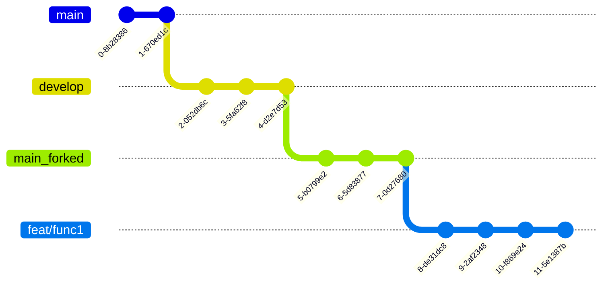

# 여행에 즐거움을 더하다 **triPlus** ✈️

</div>

**[배포 URL]**

- URL: 

**[계정]**

- 🧑🏻‍💻 id: 
- 🔐 password: 

<!-- 이미지 -->


<br>

## 1. 소개 👥

- ✈️triPlus는 다양한 사용자들의  **폭넓은 여행 후기** 및 **자신의 여행 상품을 홍보**할 수 있는 **SNS서비스**입니다.

- 여행의 재미를 더하자는 취지에서 `'trip` 과`'plus'`라는 두 단어의 합성어로 서비스명을 정했습니다.  

- 사용자는 사진을 통해 여행 후기를 공유할 수 있으며, 다른 사용자와 **좋아요** 및 **댓글**을 주고 받을 수 있습니다.

- 다른 사용자들과의 **팔로우**를 통해 자유로운 댓글 작성 및 홈 피드를 공유할 수 있습니다.

## 🙋‍♀️  triPlus 구성원 🙋‍♂️

|**김대엽**|**문승규**|**방지영**|**서정연**|
| :------------------------------------------------------------------------------------------------------------------------------------------------------: | :-------------------------------------------------------------------------------------------------------: | :---------------------------------------------------------------------------------------------------------------------------------------------------------: | :-------------------------------------------------------------------------------------------------------------------------------------------------------------: |
|  |  |  |  |
|[**GitHub**](https://github.com/kimdaeyeobbb) <br>[**blog**](https://blog.naver.com/kimdyk1)|[**GitHub**](https://github.com/munseunggyu)|[**GitHub**](https://github.com/marrron/)|[**GitHub**](https://github.com/yeon1128)|

<br>


## 2. 개발 일정 📆

#### 기간 : 2022.12.09(금) ~ 2023.01.04(수)


## 3. 개발 환경 및 회의록🔗

**[개발 환경]**

- Front-End: React, Styled-components
- Back-End: 제공된 API 사용
- 디자인 도구: [🎨Figma](https://www.figma.com/file/Qcxn5LaToq0uhbrvZeHwl8/Untitled?t=254MQgkNmEv6hDyF-0)


<br>


**[회의록 및 진행상황 공유]**

- 프로젝트 회의 : 매주 월,목 오전9시 
- 📚 회의록: [GitHub-Wiki](https://github.com/9ivot/triplus/wiki)
- 🔖 프로젝트 진행상황:  [GitHub-Projects](https://github.com/orgs/9ivot/projects/1)

<br>

## 4. 개발 규칙 🤙🏻

### ❗ 커밋 컨벤션

```plain text
type: short summary

# type: 커밋 타입
# short summary: 커밋에 대한 간단한 설명
```

- 예시

```bash
feat: 라이트 모드 기능 추가
```

#### 커밋 타입

| 커밋     | 타입 설명                                                                                        |
| :------- | :----------------------------------------------------------------------------------------------- |
| docs     | 문서 수정(md 파일 등)                                                                            |
| feat     | 새로운 기능 추가                                                                                 |
| style    | 스타일 변경 (포매팅 수정, 들어쓰기 추가, 빈칸 제거, 스펠링 오류 등)                              |
| refactor | 리팩토링 작업(코드 동작은 유지하되, 코드의 가독성 및 유지보수성을 향상시키기 위한 내부구조 변경) |
| fix      | 버그 수정                                                                                        |
| revert   | 커밋 취소(reset 사용금지)                                                                        |
| test     | 테스트 코드 추가, 기존 테스트 수정                                                               |
| build    | 빌드 관련 파일 수정 (패키지 매니저 설정등 개발코드와 무관한 부분)                                |

<br>

#### 커밋 설명 규칙

- 명령조의 현재시제를 사용한다 (과거형이나 3인칭 사용X)
  - changed(x), changes(x)
  - change(o)
- 첫 글자는 항상 소문자로 기재한다
- 마침표를 찍지 않는다
- 커밋 메시지의 각 줄은 50자를 넘기지 않는다

<br>

### 🔃 Branch 전략



- main repo > main branch: 배포용
- main repo > develop branch: 개발용 (여기서 개발완료시 main repo의 main branch로 PR하여 배포)
- forked repo > main branch
- forked repo > feat/func1 : 기능별 구현시 main repo의 develop branch로 PR
- 기능별 구현을 할때마다 PR (커밋을 모아서 PR하기를 권장)


<!-- ## 5. 프로젝트 구조 🗂 -->

<!-- 폴더 구조를 좀 정리해서 마지막에 싹 넣으면 좋을 것 같습니다. -->

```bash
├─ .env
├─ .github
│  ├─ ISSUE_TEMPLATE
│  │  └─ 개인-주차별-작업내용-템플릿.md
│  └─ pull_request_template.md
├─ .gitignore
├─ README.md
├─ package-lock.json
├─ package.json
├─ public
│  ├─ favicon.ico
│  └─ index.html
└─ src
   ├─ App.jsx
   ├─ assets
   │  └─ images
   │     ├─ circle.svg
   │     ├─ css_sprites.png
   │     ├─ error_404.svg
   │     ├─ file_gray.svg
   │     ├─ loading.png
   │     ├─ main_logo.svg
   │     ├─ more_vertical.png
   │     ├─ plain_blue.svg
   │     ├─ plain_white.svg
   │     ├─ upload_file.svg
   │     ├─ user_img_big.svg
   │     ├─ user_img_small.svg
   │     └─ x.png
   ├─ components
   │  ├─ Button
   │  │  ├─ FollowBtn
   │  │  │  ├─ IsFollowButton.jsx
   │  │  │  └─ style.js
   │  │  ├─ LongBtn.jsx
   │  │  ├─ MiddleSmallBtn
   │  │  │  └─ MiddleSmallBtn.jsx
   │  │  └─ SaveBtn
   │  │     ├─ index.jsx
   │  │     └─ style.js
   │  ├─ CommentBar
   │  │  ├─ index.jsx
   │  │  └─ style.js
   │  ├─ Header
   │  │  ├─ HeaderTitle.jsx
   │  │  ├─ Prev.jsx
   │  │  ├─ SearchButton.jsx
   │  │  ├─ SearchInput.jsx
   │  │  ├─ Vertical.jsx
   │  │  ├─ index.jsx
   │  │  └─ style.js
   │  ├─ ImageBox
   │  │  └─ index.jsx
   │  ├─ InputBox
   │  │  └─ index.jsx
   │  ├─ MainContainer.js
   │  ├─ Modal
   │  │  ├─ AlertModal.jsx
   │  │  ├─ ModalContainer.jsx
   │  │  ├─ ModalList.jsx
   │  │  └─ style.js
   │  ├─ Navbar
   │  │  ├─ index.jsx
   │  │  └─ style.js
   │  ├─ PostCard
   │  │  ├─ PostCardBtns.jsx
   │  │  ├─ index.jsx
   │  │  └─ style.js
   │  └─ UserInfo
   │     ├─ index.jsx
   │     └─ style.js
   ├─ hooks
   │  ├─ useFollowBtn.js
   │  ├─ useGetData.js
   │  ├─ useGetPreview.js
   │  ├─ useHeartBtn.js
   │  ├─ useModal.js
   │  ├─ useObserver.js
   │  ├─ usePostUpload.js
   │  └─ useReloadData.js
   ├─ index.jsx
   ├─ pages
   │  ├─ ChatList
   │  │  ├─ ChattingList.jsx
   │  │  ├─ index.jsx
   │  │  └─ style.js
   │  ├─ ChatRoom
   │  │  ├─ ChatBar.jsx
   │  │  ├─ ChatHeader.jsx
   │  │  ├─ ChatReceive.jsx
   │  │  ├─ ChatSend.jsx
   │  │  ├─ ChatVertical.js
   │  │  ├─ Chattings.jsx
   │  │  ├─ index.jsx
   │  │  └─ style.js
   │  ├─ EmailLogin
   │  │  └─ index.jsx
   │  ├─ EmailSignUp
   │  │  └─ index.jsx
   │  ├─ ErrorPage
   │  │  ├─ index.jsx
   │  │  └─ style.js
   │  ├─ Follow
   │  │  ├─ index.jsx
   │  │  └─ style.js
   │  ├─ Home
   │  │  ├─ HomeNoFollow.jsx
   │  │  ├─ index.jsx
   │  │  └─ style.js
   │  ├─ LoadingPage
   │  │  ├─ index.jsx
   │  │  └─ style.js
   │  ├─ MultiLogin
   │  │  ├─ JoinLink.jsx
   │  │  ├─ LoginModal.jsx
   │  │  ├─ SocialLoginItem.jsx
   │  │  └─ index.jsx
   │  ├─ MyProfileAddProduct
   │  │  └─ index.jsx
   │  ├─ MyProfileEdit
   │  │  └─ index.jsx
   │  ├─ PostDetail
   │  │  ├─ Comment.jsx
   │  │  ├─ UserPostDetail.jsx
   │  │  ├─ index.jsx
   │  │  └─ style.js
   │  ├─ PostUpload
   │  │  ├─ PreviewList.jsx
   │  │  ├─ index.jsx
   │  │  └─ style.js
   │  ├─ ProductUpload
   │  │  ├─ index.jsx
   │  │  └─ style.js
   │  ├─ Profile
   │  │  ├─ BottomSection.jsx
   │  │  ├─ MidSection.jsx
   │  │  ├─ TopSection.jsx
   │  │  ├─ TopSectionMy.jsx
   │  │  ├─ TopSectionYour.jsx
   │  │  ├─ index.jsx
   │  │  └─ style.js
   │  ├─ Search
   │  │  ├─ index.jsx
   │  │  └─ style.js
   │  ├─ SetProfile
   │  │  └─ index.jsx
   │  └─ SplashScreen
   │     ├─ index.jsx
   │     └─ splashEvent.jsx
   ├─ theme.js
   └─ utils
      ├─ handleCommentTime.js
      ├─ handleDeclaration.js
      └─ handleDelete.js
```

<br>

## 6. 역할 분담 👨‍👩‍👧‍👧

### 🧑🏻‍💻김대엽

- splash 페이지, 로그인 페이지, 상대방 프로필 페이지
- 게시글 컴포넌트, 프로필 카드 컴포넌트

### 🧑🏻‍💻문승규

- axios 모듈화, 커스텀 라우터 개발
- 상단 네브바 컴포넌트, 판매중인 상품 컴포넌트, 팝업 모달 컴포넌트
- 회원가입 페이지, 프로필 페이지, 프로필 수정 페이지, 팔로잉/팔로우 페이지, 상품등록 페이지, 상품수정 페이지, 게시글 업로드 페이지

### 👩🏻‍💻방지영

- 메인 피드 페이지, 검색 페이지
- 프로필 이미지 컴포넌트, 하단 네브바 컴포넌트
- 디자인 기획 및 에셋 제작

### 👩🏻‍💻서정연

- 이메일 회원가입 페이지, 게시글 업로드 페이지, 게시글 상세 페이지
- 슬라이드 모달 컴포넌트, 버튼 컴포넌트, 댓글 컴포넌트
- 디자인 기획 및 에셋 제작

<br>


## 7. 구현 기능 🛠

### 7-1. 홈
<table>
    <tbody>
        <tr></tr>
        <tr>
            <th>시연</th>
            <th>설명</th>
        </tr>
        <tr>
            <td></td>
            <td>홈/스플래쉬<ul>
                    <li>시작하기 버튼을 통해 서비스에 접속할 수 있습니다.</li>
                    <li>로그인: 메인 게시판으로 이동</li>
                    <li>비로그인: 로그인화면으로 이동</li>
                </ul>
            </td>
        </tr>
        <tr></tr>
        <tr>
            <td></td>
            <td>로그인<ul>
                    <li>유효성 검사를 진행하고, 오류 메시지를 제공합니다. </li>
                    <li>이메일과 비밀번호가 유효한 경우 게시판 화면으로 이동합니다.</li>
                </ul>
            </td>
        </tr>
        <tr></tr>
        <tr>
            <td></td>
            <td>회원가입<ul>
                    <li>사용자의 정보를 입력받아 회원가입을 진행합니다.</li>
                    <li>유효성 검사를 진행하고, 오류 메시지를 전달합니다.</li>
                    <li>모달창을 이용하여 커뮤니티 규칙과 개인정보 수집/이용 동의를 제공합니다.</li>
                </ul>
            </td>
        </tr>
    </tbody>
</table>
    
<br>
    
### 7-2. 게시판
<table>
    <tbody>
        <tr></tr>
        <tr>
            <th>시연</th>
            <th>설명</th>
        </tr>
        <tr>
            <td></td>
            <td>게시판<ul>
                    <li>인기/최신으로 게시글 정렬 순서를 변경할 수 있습니다.</li>
                    <li>드롭다운으로 카테고리를 지정할 수 있습니다.</li>
                    <li>이미지가 업로드 되지 않은 게시글은 카테고리별 기본 이미지를 제공합니다.</li>
                </ul>
            </td>
        </tr>
    </tbody>
</table>
<br>

### 5-3. 게시글
<table>
    <tbody>
        <tr></tr>
        <tr>
            <th>시연</th>
            <th>설명</th>
        </tr>
        <tr>
            <td></td>
            <td>업로드<ul>
                    <li>드롭다운 메뉴를 통해 게시글의 카테고리를 설정합니다.</li>
                    <li>첨부파일 선택 버튼을 이용하여 이미지를 업로드할 수 있습니다.</li>
                </ul>
            </td>
        </tr>
        <tr></tr>
        <tr>
            <td></td>
            <td>게시글<ul>
                    <li>좋아요/스크랩이 가능하며, 댓글을 게시할 수 있습니다.</li>
                    <li>작성한 게시글에만 삭제 버튼이 활성화되어, 작성자만 삭제할 수 있습니다.</li>
                </ul>
            </td>
        </tr>
    </tbody>
</table>
<br>

### 5-4. 프로필
<table>
    <tbody>
        <tr></tr>
        <tr>
            <th>시연</th>
            <th>설명</th>
        </tr>
        <tr>
            <td></td>
            <td>프로필<ul>
                    <li>사용자의 프로필 정보를 제공합니다.</li>
                    <li>작성한 게시글, 좋아요, 스크랩한 게시글의 목록을 확인할 수 있습니다.</li>
                    <li>로그아웃을 할 수 있으며, 시작 페이지로 돌아갑니다.</li>
                </ul>
            </td>
        </tr>
        <tr></tr>
        <tr>
            <td></td>
            <td>프로필 편집<ul>
                    <li>프로필 이미지를 변경하거나, 업로드한 이미지를 삭제할 수 있습니다.</li>
                    <li>새로운 닉네임의 중복 여부를 확인한 후 변경합니다.</li>
                </ul>
            </td>
        </tr>
    </tbody>
</table>

<br>

## 7. 핵심 코드

### 1) Private Route

기존에 페이지마다 useEffect를 이용해서 유저 정보를 확인했는데 이러한 중복코드가 발생해서 커스텀 라우터를 개발했습니다.

```js
useEffect(() => {
  const userInfo = JSON.parse(localStorage.getItem("userInfo"));
  const token = userInfo?.token;

  if (!token) {
    props.history.push("/login");
    return;
  }
}, []);
```

페이지에 들어올 때 유저정보가 존재하지않다면 로그인 화면으로 보낼 수 있도록 구현했습니다.

```jsx
export default function PrivateRoute({ children, ...rest }) {
  const userInfo = getUserInfo();

  return (
    <Route
      {...rest}
      render={(props) =>
        userInfo ? (
          React.cloneElement(children, { ...props })
        ) : (
          <Redirect
            to={{
              pathname: "/login",
              state: { from: props.location },
            }}
          />
        )
      }
    />
  );
}
```

커스텀 라우터를 사용할 때는 아래와 같이 사용할 수 있습니다.

```js
<PrivateRoute path="/profile" exact>
  <ProfilePage />
</PrivateRoute>
```

### 2) API

기존에 Fetch를 이용해서 API 통신을 했는데, 중복된 코드가 너무 많이 생긴다고 생각했습니다.

```js
async function handlePostDeleteRequest(token) {
  const url = "https://mandarin.api.weniv.co.kr";
  const reqPath = `/post/${id}`;
  try {
    const res = await fetch(url + reqPath, {
      method: "DELETE",
      headers: {
        Authorization: `Bearer ${token}`,
        "Content-type": "application/json",
      },
    });
    const resData = await res.json();
    return resData;
  } catch (err) {
    console.error("error");
  }
}
```

그래서 axios를 도입하고, axios instance 만들어서 url과 header를 넣어놓았습니다.

```js
export const axiosInstanceWithToken = axios.create({
  baseURL: API_URL,
  headers: {
    "Content-Type": "application/json",
  },
});
```

그리고 axios의 인터셉터를 이용해서 request 보내기 이전에 토큰정보가 있는지 확인하고 토큰정보가 존재하면 요청을 보낼 수 있도록 개발을 했습니다.

```js
axiosInstanceWithToken.interceptors.request.use((request) => {
  // axiosInstanceWithToken에서 토큰이 존재하지 않으면 서버에 request를 보내지 않습니다.
  const { token } = getUserInfo();
  if (!token) {
    throw new Error("토큰이 없습니다. 다시 로그인해주세요.");
  }

  // 토큰이 존재하면 headers에 토큰을 넣어서 서버에 request를 보냅니다.
  request.headers.Authorization = `Bearer ${token}`;
  return request;
});
```

axios api는 apis 폴더에 따로 분리해서 작성하고 axios를 사용하는곳에서는 사용할 모듈을 import하여 사용할 수 있도록 만들었습니다.

```js
export const axiosGetPostDetail = async (postId) => {
  try {
    const { data } = await axiosInstanceWithToken.get(`/post/${postId}`);
    return data;
  } catch (error) {
    console.error("axiosGetPostDetail error", error);
  }
};
```

## 8. 레슨런 및 고생담, 스페셜 포인트

### 1) 기술적 측면

- React 사용법
- fetch와 axios를 이용한 API통신
- Git flow 브랜치 전략
- 깃 커밋 메시지 컨벤션

### 2) 팀원 간 깃헙으로 커뮤니케이션 하는데에 어려움

- 커밋 단위를 작게 가져가기.
- 이슈와 풀리퀘에 상세한 설명 달기.
- 필요한 경우 주석 달기.
- 로켓으로 머지 사인 날리기 🚀

### 3) 기술적인 부분을 더 겪어본 팀원과 덜 겪어본 팀원과 커뮤니케이션이 어려웠던 이유

- 고생한 것을 쉽게 끝내버릴까봐 기다려주는 팀원 🤔
- 단서가 될만한 한마디를 들으려면 어떻게 질문해야하는지부터가 막막한 팀원 😯
- 데일리스크럼을 통한 상황공유가 첫번째 해결책. 그 외에 코드 설명하는 영상을 찍어서 다시 볼 수 있게끔 해주거나 막연한 질문을 받아적어서 이해해보려는 노력 등이 오갔다.

### 4) 게시글 작성 기능의 수렁

- 약 200번 가량의 업로드 시도.
- `URL.createObjectURL`로는 프리뷰 이미지 만들고, `readAsDataURL`로는 파일 읽고, `formData`에 읽은 파일들 append하고, `formData`에 들어간 배열 요소들을 연결하여 하나의 문자열로 API에 전송.
- 가장 어려웠던 점 : 질문 후 힌트 코드를 서너번 받았음에도 내 코드에 적용을 못했고 어디서부터 다시 이해해야할지 막막했다.
- 레슨런: 번아웃이 가깝게 왔지만 끝까지 붙잡고 완벽하진 않아도 작동하게 만든 것은 성공. 더 끈질기게 질문하진 못해서 시간이 많이 소요된 것은 아쉬운 점. 팀프로젝트인만큼 속도 또한 퀄리티 요소로 생각해야했다.
<div align='center'>

</div>

### 5) 스페셜포인트

- 배터디룸

  - 팀원분 집에서 같이 지내며 프로젝트를 진행, 온전히 프로그래밍에만 집중할 수 있는 뜻깊은 경험.
  - 언제든지 방문해서 함께 코딩 가능한 공간.  
  <br/>
  <div align='center'>
  
  </div>

- 밤샘 줌
  - 줌 시간 무제한 결제.
  - 빠른 의사결정.
  - 원격 제어를 통한 페어프로그래밍.  
  <br/>
  <div align='center'>
  
  </div>
- 구글 스프레드 시트와 데일리 스크럼
  - 아침 9시 30분에 오늘 진행할 일과 도움 청할 일을 간단히 공유.
  - 구글 스프레드 시트를 이용하여 참여도 활성화.
  <br/>
  <div align='center'>
  
  
  </div>

<!-- ## 6. 개발 이슈 💡 -->

<!-- 프로젝트하며 겪었던 이슈중에 남기고싶은 이슈 -->
<!-- 코드 방향성에 대해 고민했던 이슈 -->

<!-- 프로젝트 회고 -->
